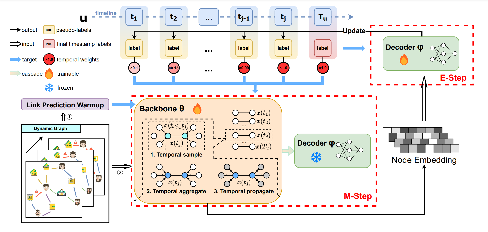

# FLiD: **F**ramework for **L**abel-L**i**mited **D**ynamic Node Classification
[](https://opensource.org/licenses/MIT)
[](https://pytorch.org/)

This repository is built for the paper

<!-- [PTCL: Pseudo-Label Temporal Curriculum Learning for Label-Limited Dynamic Graph](https://arxiv.org/abs/2504.17641) -->
PTCL: Pseudo-Label Temporal Curriculum Learning for Label-Limited Dynamic Graph

FLiD is a novel framework for dynamic graph learning where only final timestamp labels are available. Designed for extensibility and fairness, it supports cutting-edge research in temporal graph analysis through:

<p align="center">
  
</p>

## 🚀 Key Features
- **Novel Architecture**
  * Dual-model EM optimization with pseudo-label enhancement
  * Support for below paradigms with modular components: 
    * CFT (Copy-Final Timestamp labels) 
    * DLS (Dynamic Label Supervision)
    * NPL (Naive Pseudo-Labels) 
    * SEM (Standard EM) 
    * PTCL-2D (PTCL with 2 Decoders) 
    * PTCL
  
  * Support for below pseudo-labels enhancement methods:
    * Confidence Score Threshold (CST)
    * Entropy of Softmax Trajectory (EST) 
    * Temporal Curriculum Learning

  * Support for below various backbone models for Label-limited Dynamic Node Classification:
    * TGAT 
    * TGN 
    * GraphMixer
    * TCL
    * DyGFormer 

  * Support for below datasets:
    |                         | Wikipedia | Reddit  | Dsub   | CoOAG  |
    |-------------------------|-----------|---------|--------|--------|
    | **Nodes**               | 9,227     | 10,984  | 150,000| 9,559  |
    | **Edges**               | 157,474   | 672,447 | 168,154| 114,337|
    | **Duration**            | 1 month   | 1 month | 1 year | 22 years|
    | **Total classes**       | 2         | 2       | 2      | 5      |
  * Adaptive weight scheduling (`gt_weight` decay)

- **Comprehensive Support**
  ```python
  # Flexible training workflows
  for k in range(args.num_em_iters):
      e_step(...)  # Expectation step
      m_step(...)  # Maximization step
      update_pseudo_labels(...)  # Label refinement
  ```

- **Research-Ready Infrastructure**
  - Automatic metric tracking (AUC/Accuracy)
  - Early stopping with model checkpointing
  - Reproducible seed management
  - Multi-run experiment support

## 🛠 Usage

- **Data Preprocessing**

    Use the `preprocess` script to process the data. The data will be made publicly available soon.

- **Step 1: Warmup**

    1. Configure the following parameters for the warmup training:
    - `model_name`: Choose the model (e.g., `TGAT`)
    - `gpu`: Specify the GPU to use (e.g., `5`)
    - `dataset`: Choose the dataset (e.g., `reddit` or `wikipedia`)
    - `threshold`: Pseudo-label threshold (e.g., `0.5`)
    - `gt_weight`: Pseudo-label weight (e.g., `0.9`)
<!-- 
    Run the warmup step:

    ```bash
    bash warmup.sh
    ``` -->

- **Step 2: Training**

    1. Configure the following parameters for training:
    - `method`: Choose the training method (e.g., `PTCL`, `SEM`, `NPL`)
    - `dataset`: Choose the dataset (e.g., `reddit`, `wikipedia`, `oag`)
    - `gt_weight`: Pseudo-label weight (e.g., `0.5`)
    - `alphas`: Set different hyperparameters (e.g., `0.1`)
    - `gpus`: Specify the GPUs to use (e.g., `[1]`)
    - `max_tasks_per_gpu`: Maximum tasks per GPU (e.g., `1`)
<!-- 
    Run the training script:

    ```bash
    bash train.sh
    ``` -->

- **Results**

    - During training, the `logs/` directory will save the training logs.
    - The `results/` directory will store the training results.
    - You can evaluate the model performance using the output `AUC` and `ACC`.

## 📊 Method Comparison

| Method       | EM Steps | Pseudo-Label Strategy     | Key Characteristics                 |
|--------------|----------|---------------------------|-------------------------------------|
| **CFT**      | None     | Copy Final Labels         | Baseline with label propagation     |
| **DLS**      | None     | Full Supervision          | With dynamic labels             |
| **NPL**      | None     | Joint Optimization with generated pseudo-labels       | Single-phase training               |
| **SEM**      | Full  | 2-stage generate pseudo-labels          | Standard EM Implementation          |
| **PTCL**     | Full     | E-step generate pseudo-labels       | Dual-phase EM + Temporal Filtering  |
| **PTCL-2D**  | Full     | Dual-Decoder Architecture | Prevents confirmation bias          |


## 📂 Repository Structure
```
FLiD/
├── models/                    # Various Backbone
├── logs/                      # Training metrics & logs
│   └── {method}/              # Per-method organization
├── results/                   # Trainin results
│   └── {method}/              # Per-method organization
├── saved_models/              # Model checkpoints
├── process_data/              # Preprocess tools
├── processed_data/            # Preprocessed datasets
│
├── PTCL/                      # Core EM implementation
│   ├── EM_init.py             # Model initialization
│   ├── EM_warmup.py           # Model warmup
│   ├── E_step.py              # Expectation phase
│   └── M_step.py              # Maximization phase
│   ├── trainer.py             # Trainier initialization
│   ├── utils.py               # Important utils tools
│
├── NPL/                       # Core NPL implementation
│   ├── NPL_init.py            # Model initialization
│   ├── NPL.py                 # Training phase
│
├── SEM/                       # Core NPL implementation
│   ├── E_step.py              # Expectation phase
│   ├── M_step.py              # Maximization phase
│
├── utils/                     # Infrastructure
│   ├── DataLoader.py          # Dataset processing
│   ├── EarlyStopping.py       # Training control
│   └── load_configs.py        # Logging setup
│   └── utils.py               # Useful tools
│   └── metrics.py             # Metrics calculating tools
│
└── train.py                   # Experiment entry point
```

## 📈 Evaluation Metrics
Framework tracks multiple metrics through `log_and_save_metrics()`:
```python
# Sample metric output
2025-1-15 14:30:00 - Estep - INFO - Test Metrics:
{
    "AUC": 0.892,
    "Accuracy": 0.814,
    "Loss": 0.423
}
```

## 🤝 Contributing
We welcome contributions! Please follow our [contribution guidelines](CONTRIBUTING.md) and:
- Use consistent logging practices
- Maintain backward compatibility
- Add unit tests for new features

## 📜 Citation
If using FLiD in your research, please cite:
```bibtex
@article{ptcl2025,
  title={PTCL: Pseudo-Label Temporal Curriculum Learning for Label-Limited Dynamic Graph},
  author={Shengtao Zhang, Haokai Zhang, Shiqi Lou, Zicheng Wang, Zinan Zeng, Yilin Wang, Minnan Luo},
  year={2025}
}
``` 

## License
This project is licensed under the [MIT License](LICENSE).